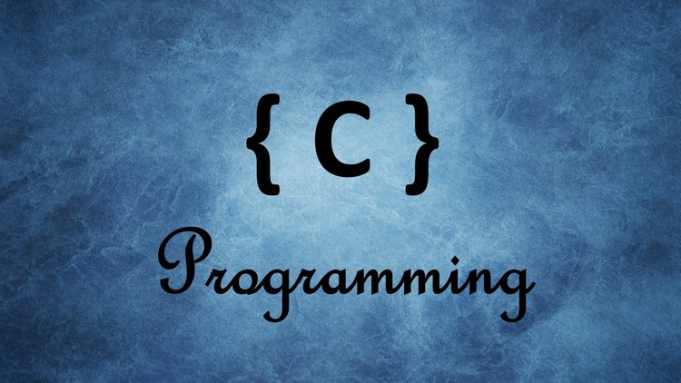

# A Road Map For Embedded Systems

>This roadmap was created for the Embedded Systems committee in ***IEEE Mansoura Computer Society Chapter*** by Mahmoud Essam Mahfouz, head of the committee. I hope you get the most benefit from it.

## Objectives:

>The main goal for this road map is to prepare committee members to be able to work as Embedded Software Engineer either in a company or as a freelancer

## Levels:

- Beginner : Introduction to Embedded & C Language
- Intermediate: Data Structure & Embedded C
- Advanced: Interfacing

## Beginner : C Language

### Objectives:
- Learning concepts related to basics of embedded systems 
- Learning concepts related to basics of programming, such as: compiler, IDE, packages, libraries
- Learning about the compilation process
- Learning C programming language Syntax
- Solving many programming problems using C language
### Weeks

#### Final Project
## Intermediate : Data Structure & Embedded C

### Objectives:
- Having a good background about Data structures
- Learning about Stack, Queue and Linked list
- Being able to customize and implement a new data structure
- Learning how to use C in Embedded (Embedded C)

### Weeks: 
- [Week14:](Weeks/Week14.md) Stack Array Based 
- [Week15:](Weeks/Week15.md) Linked List & Queue
- [Week16:](Weeks/Week16.md) Data Structure Project
- [Week17:](Weeks/Week17.md) Embedded C - Part1
- [Week18:](Weeks/Week18.md) Embedded C - Part2

## Advanced : Interfacing

### Objectives:
- Studying Atmega32(AVR) and PIC microcontrollers and writing drivers for them
- Learning about Interrupts and how do they work ?
- Writing Driver for GPIO and LCD
- Learning communication protocols (USART, SPI, I2C)

### Weeks:
- [Week19:](Weeks/Week19.md) How Electricity Works ?
- [Week20:](Weeks/Week20.md) Interfacing 
- [Week21:](Weeks/Week21.md) GPIO & LCD
- [Week22:](Weeks/Week22.md) Interrupt & Shared Data Problem
- [Week23:](Weeks/Week23.md) UART & SPI
- [Week24:](Weeks/Week24.md) Stack, Exception handling, C Start up & Linker Script

#### Final Project