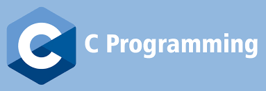

# A Road Map For Embedded Systems

>This roadmap was created for the Embedded Systems committee in ***IEEE Mansoura Computer Society Chapter*** by Mahmoud Essam Mahfouz, head of the committee. I hope you get the most benefit from it.

## Objectives:

>The main goal for this road map is to prepare committee members to be able to work as Embedded Software Engineer either in a company or as a freelancer

## Levels:

- Beginner : C Language
- Intermediate: Data Structure
- Advanced: Embedded C & Interfacing

## Beginner : C Language

### Objectives:
- Learning concepts related to basics of programming, such as: compiler, IDE, packages, libraries
- Learning about the compilation process
-  Learning C programming language Syntax
- Solving many programming problems using C language
### Weeks

#### Final Project
## Intermediate : Data Structure

### Objectives:
- Having a good background about Data structures
- Learning about Stack, Queue and Linked list
- Being able to customize and implement a new data structure

### Weeks: 
- Week1: [Videos 1 to 5 (Stack Array Based)](https://www.youtube.com/watch?v=cGgzFPRLl4o&list=PLoK2Lr1miEm-5zCzKE8siQezj9rvQlnca&index=1)
- Week2: [Videos 6 and 7 (Linked List)](https://www.youtube.com/watch?v=cGgzFPRLl4o&list=PLoK2Lr1miEm-5zCzKE8siQezj9rvQlnca&index=1)
- Week3: [Videos 10 and 11 (Queue)](https://www.youtube.com/watch?v=cGgzFPRLl4o&list=PLoK2Lr1miEm-5zCzKE8siQezj9rvQlnca&index=1)
#### Final Project

## Advanced : Interfacing

### Objectives:
- Learning about boot loader, linker script and makefile
- Studying Atmega32(AVR) and writing drivers for it
- Learning  communication protocols (USART, SPI, I2C)

### Weeks

#### Final Project